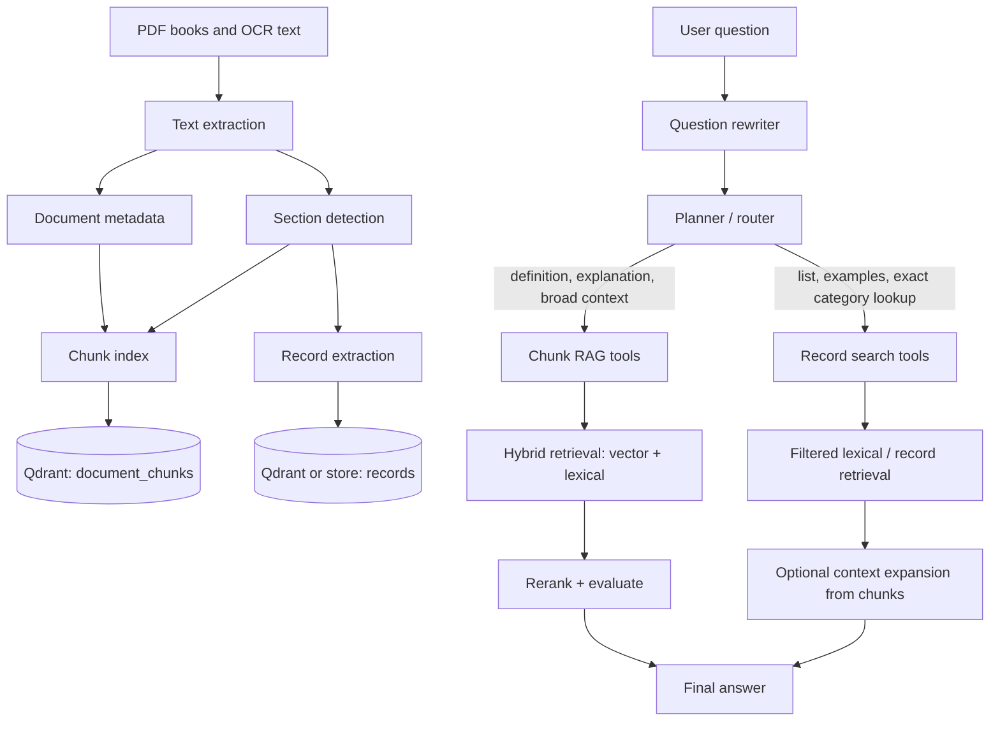
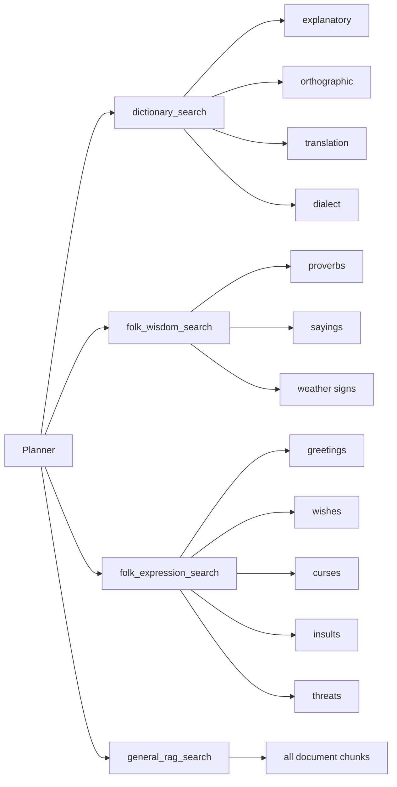

# RAG Search Architecture Proposal

Гэта прапанаваная схема для перапрацоўкі слоўнікавага бота так, каб пошук па катэгорыях знаходзіў рэальныя элементы з кніг, нават калі карыстальнік не называе дакладнае слова з тэксту.

## Мэта

Асноўная праблема: запыты тыпу `дай вітанні`, `знайдзі праклёны`, `пакажы абразы`, `прыкметы пра дождж` задаюць катэгорыю, а не дакладны радок з кнігі. Звычайны chunk-based RAG добра працуе для дакладных слоў, але часта мае нізкі recall, калі трэба перайсці ад катэгорыі да ўсіх адпаведных элементаў у раздзеле.

Прапанова: пакінуць агульны RAG па чанках, але дадаць асобны слой структурных запісаў для кароткіх фальклорных і слоўнікавых адзінак.

Ключавая ідэя: запыт `вітанні` павінен спачатку мапіцца на `recordType = greeting`, `sectionTitle = Вітанні`, сінонімы і магчымыя старонкі раздзела, а не шукацца толькі як embedding-запыт па слове `вітанні`.

## Агульная Схема



## Два Ўзроўні Індэкса

### 1. `document_chunks`

Гэта цяперашні RAG-слой. Ён патрэбны для пытанняў, дзе карыстальніку трэба тлумачэнне, кантэкст або адказ па вялікім фрагменце.

Прыклад payload:

```json
{
  "text": "старонкавы фрагмент кнігі...",
  "source": "proverbs/Vusacki_slovazbor_Ryhora_Baradulina_2013.pdf",
  "fileName": "Vusacki_slovazbor_Ryhora_Baradulina_2013.pdf",
  "sourceBook": "vushatski_slovazbor",
  "category": "dialect",
  "dictionaryType": "dialect",
  "sectionTitle": "Гразьбы",
  "loc": { "pageNumber": 123 },
  "chunkIndex": 4
}
```

Выкарыстоўваць для:

- тлумачэння значэння слова;
- пошуку шырокага кантэксту;
- адказаў на пытанні `што ў кнізе ёсць пра ...`;
- суседніх старонак вакол знойдзенага record.

### 2. `records`

Гэта новы структурны слой. Ён патрэбны для кароткіх адзінак: прыказак, вітаняў, праклёнаў, абразаў, прыкмет, асобных слоўнікавых артыкулаў.

Прыклад payload:

```json
{
  "recordText": "Добры дзень!",
  "normalizedText": "добры дзень",
  "recordType": "greeting",
  "category": "folk_expression",
  "sourceBook": "vushatski_slovazbor",
  "sectionTitle": "Вітанні",
  "tags": ["вітанне", "здароўканне"],
  "source": "proverbs/Vusacki_slovazbor_Ryhora_Baradulina_2013.pdf",
  "page": 123
}
```

Выкарыстоўваць для:

- `дай вітанні`;
- `пакажы праклёны`;
- `знайдзі абразы`;
- `прыкметы пра дождж`;
- `падбяры прыказкі пра працу`;
- любых list/extract запытаў, дзе трэба вярнуць толькі тое, што ёсць у кнізе.

## Метаданыя

Мінімальны набор палёў:

| Field | Прызначэнне |
| --- | --- |
| `sourceBook` | Стабільны id кнігі: `vushatski_slovazbor`, `proverbs_dictionary`, `explanatory_dictionary` |
| `category` | Шырокая катэгорыя: `dictionary`, `dialect`, `folk_wisdom`, `folk_expression` |
| `dictionaryType` | Тып слоўніка: `explanatory`, `orthographic`, `translation`, `dialect`, `proverbs`, `none` |
| `sectionTitle` | Назва раздзела з кнігі, калі яе можна вызначыць |
| `recordType` | Тып кароткай адзінкі: `greeting`, `curse`, `insult`, `threat`, `proverb`, `weather_sign`, `definition` |
| `tags` | Сінонімы і ручныя пазнакі для дакладнага пошуку |
| `page` / `loc.pageNumber` | Старонка для цытавання і context expansion |

## Катэгорыі Record Types

Пачатковы набор:

```ts
type RecordType =
  | 'greeting'
  | 'farewell'
  | 'wish'
  | 'curse'
  | 'insult'
  | 'threat'
  | 'proverb'
  | 'saying'
  | 'weather_sign'
  | 'folk_belief'
  | 'dialect_word'
  | 'definition';
```

Гэты набор лепш трымаць невялікім. Калі катэгорыя пачынае мець асобную логіку пошуку або адказу, тады яе варта выносіць у асобны `recordType`.

## Routing

Planner павінен выбіраць не толькі тул, але і рэжым:

```ts
type RetrievalMode = 'answer' | 'list' | 'extract' | 'section' | 'explore';
```

Правілы:

| Запыт | Рэжым | Пошук |
| --- | --- | --- |
| `што значыць слова аброць` | `answer` | `document_chunks`, тлумачальны або дыялектны тул |
| `дай вітанні` | `list` | `records` з `recordType = greeting` |
| `знайдзі праклёны` | `list` | `records` з `recordType in curse/threat` |
| `прыкметы пра дождж` | `list` | `records` з `recordType = weather_sign`, плюс topic filter |
| `што ў Вушацкім словазборы пра гразьбы` | `section` | спачатку records/section, потым adjacent chunks |
| `растлумач кантэкст гэтай прыказкі` | `answer` | record lookup -> adjacent chunks -> final answer |

## Tool Layout



Практычна гэта не абавязкова павінна быць шмат асобных класаў. Можна мець адзін `RecordSearchTool`, які прымае план:

```json
{
  "tool": "record_search",
  "recordTypes": ["greeting"],
  "sourceBook": "vushatski_slovazbor",
  "query": "вітанні",
  "resultMode": "list",
  "desiredResultCount": 20
}
```

## Пошук Па Сінонімах

Для катэгорый патрэбны просты слоўнік трыгераў. Гэта не проста дапамога planner-у; гэта механізм recall. Ён дазваляе знайсці элементы, у якіх няма слова карыстальніка, але якія належаць да патрэбнай катэгорыі.

```ts
const RECORD_TYPE_TRIGGERS = {
  greeting: ['вітанне', 'вітанні', 'прывітанне', 'здароўканне', 'добры дзень'],
  farewell: ['развітанне', 'бывай', 'да пабачэння'],
  wish: ['пажаданне', 'зычэнне', 'здароўя', 'шчасця'],
  curse: ['праклён', 'праклёны', 'праклены', 'гразьбы', 'кляцьба'],
  insult: ['абраза', 'абразы', 'лаянка', 'знявага'],
  threat: ['пагроза', 'пагрозы', 'пужанне'],
  weather_sign: ['прыкмета', 'прыкметы', 'надвор\'е', 'дождж', 'мароз', 'вецер']
};
```

Гэтыя трыгеры выкарыстоўваюцца ў двух месцах:

1. planner/router для выбару `recordType`;
2. retrieval для пашырэння lexical-запыту.

## Recall Strategy For Category Search

Для запытаў па катэгорыях пошук павінен ісці не адным embedding-запытам, а некалькімі праходамі:

1. Вызначыць `recordType` праз трыгеры і planner.
2. Паспрабаваць дакладны фільтр па `recordType`.
3. Калі records яшчэ не вынятыя, шукаць раздзел праз `sectionTitle` і aliases.
4. Калі раздзел знойдзены, вярнуць усе records або chunks з гэтага дыяпазону старонак.
5. Толькі пасля гэтага выкарыстоўваць semantic/vector search як fallback.

Прыклад для `дай вітанні`:

```json
{
  "query": "дай вітанні",
  "recordTypes": ["greeting"],
  "sectionAliases": ["Вітанні", "Прывітанні", "Здароўканне"],
  "expandedQueries": ["вітанне", "вітанні", "прывітанне", "здароўканне", "добры дзень"],
  "retrievalOrder": ["recordType", "sectionTitle", "pageRange", "lexical", "vector"]
}
```

Гэта важней за reranking: калі патрэбны раздзел або records не трапілі ў candidate set, reranker ужо не зможа іх аднавіць.

## Answer Policy

Для `list` і `extract` рэжымаў фінальны адказ павінен мець жорсткае правіла:

> Выводзь толькі элементы, якія ёсць у `records` або ў цытаваных крыніцах. Не стварай новыя прыклады. Калі знойдзена мала, скажы дакладную колькасць знойдзеных элементаў.

Прыклад адказу:

```text
У "Вушацкім словазборы" знойдзеныя такія вітанні:

1. ...
2. ...
3. ...

Крыніца: Вушацкі словазбор, стар. 123.
```

Калі records не знойдзены:

```text
У праіндэксаваных запісах вітанні не знойдзеныя. Пашукаю шырэй па раздзелах і старонках, звязаных з вітаннем.
```

## Рэкамендаваны План Укаранення

1. Дадаць `sourceBook`, `sectionTitle`, `recordType`, `tags` у payload.
2. Для `Вушацкага словазбору` зрабіць ручную або паўаўтаматычную мапу раздзелаў па старонках.
3. Дадаць `records` extractor для кароткіх радкоў/артыкулаў у раздзелах.
4. Рэалізаваць `RecordSearchTool` з фільтрамі па `recordType`, `sourceBook`, `sectionTitle`.
5. Абнавіць planner schema: дадаць `recordTypes`, `retrievalMode`, `sourceBook`.
6. Для `list/extract` адказаў зрабіць retrieval-first паводзіны: калі records не знойдзеныя, пашыраць пошук да section/page range, а не адразу пераходзіць да звычайнага semantic RAG.
7. Дадаць eval-набор: `вітанні`, `праклёны`, `абразы`, `прыкметы пра дождж`, `прыказкі пра працу`.

## Чаму Гэта Прасцей І Дакладней

- Катэгорыі вырашаюцца фільтрамі, aliases і section lookup, а не выпадковай семантычнай блізкасцю.
- Кароткія адзінкі вяртаюцца як records, таму запыт па катэгорыі знаходзіць элементы нават без дакладнага супадзення словаў.
- Chunks застаюцца для кантэксту, але не змешваюцца з задачамі тыпу `дай спіс`.
- Planner атрымлівае ясны выбар: `answer` праз RAG або `list/extract` праз records.
